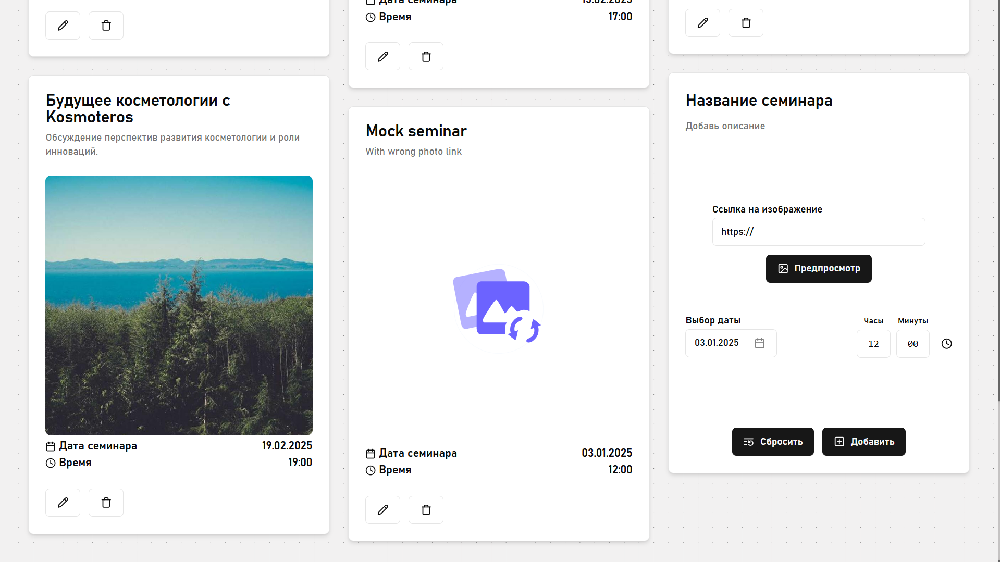

# Seminar Manager
Seminar Manager is a simple React application designed for managing seminars. This project demonstrates core CRUD operations by:
- Fetching seminar data from a local JSON-server.
- Allowing users to add a new seminar via an inline editable card.
- Previewing images with fallback animations for different scenarios.
- Utilizing a custom fetch wrapper to handle API calls without relying on bulky libraries.

This project is designed primarily for local development as specified by the assignment

## Getting Started
### Prerequisites
- Node.js (v14 or higher recommended)
- npm
- git
### Installation & Running Locally
1. Clone repo
`git clone git@github.com:B1aho/Seminar-Manager.git`
`cd cloned_repo`
2. Install Dependencies
`npm install`
3. Start app: 
The project includes both the React application and the JSON-server in the same repository. A single command will launch them concurrently 
`npm start`

## Features
- Seminar List: Displays a list of seminars fetched from a local JSON-server with responsive masonry layout.
- Add Seminar Card: An inline editable card for quickly adding (POST) a new seminar.
- Image Preview & Fallback Animations: Supports live image previews and fallback animations for various states.
- Custom Fetch Wrapper: A lightweight wrapper around the fetch API for GET, POST, and other requests.

## Screenshots

